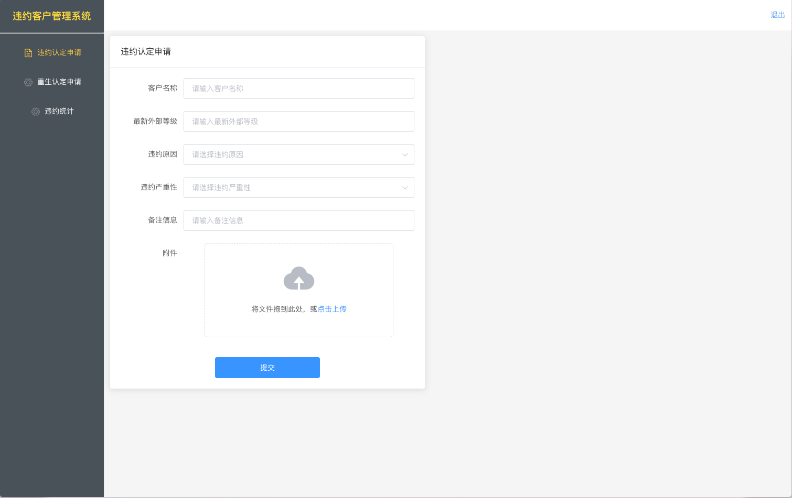
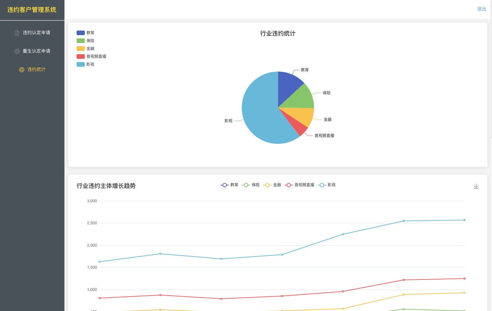

# 违约用户管理系统
> 基于 Vue2 + ElementUI + EChart 的违约用户管理系统前端




## Project setup
```
pnpm install
```

### Compiles and hot-reloads for development
```
pnpm run serve
```

### Compiles and minifies for production
```
pnpm run build
```

